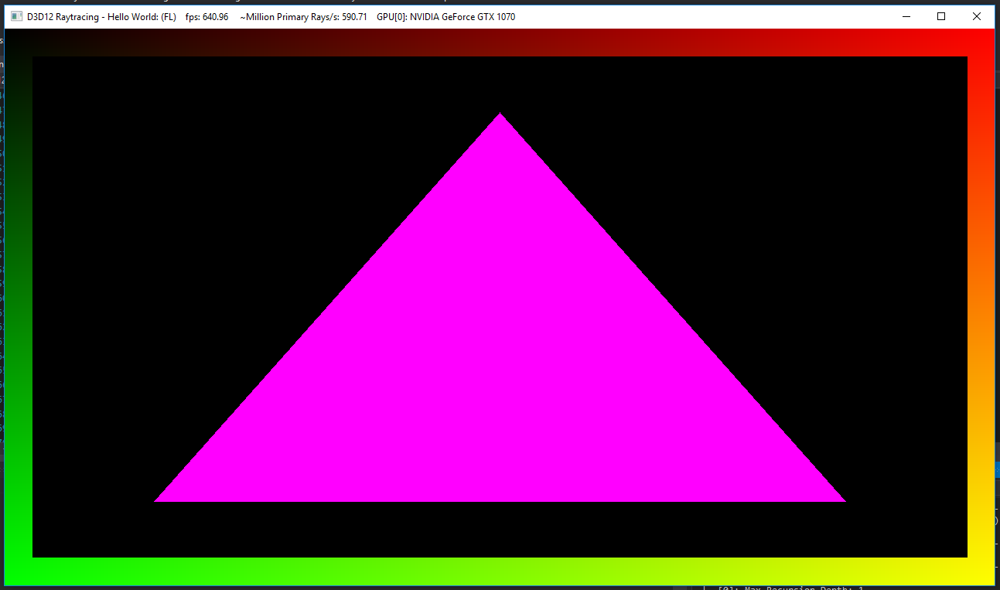

Project 0 Getting Started
====================

**University of Pennsylvania, CIS 565: GPU Programming and Architecture, Project 0**

* Tabatha Hickman
  * LinkedIn: https://www.linkedin.com/in/tabatha-hickman-335987140/
* Part 2.3 (DXR) tested on: Windows 10, Xeon E5-1630 v4 @ 3.70GHz 32GB, GTX 1070 (SIGLAB computer)
* Everything else tested on: Windows 10, i7-5600U CPU @ 2.60GHz 16GB, GeForce 840M (personal computer)
  * Note: I didn't restart after installing updates to my drivers, so that might have affected my results. 

**Note on Collaborators**

When I did my work on the Siglab machine for DXR, I went to push my commit and I was not allowed because I was logged in as Alexis. I tried to change this with git config, but to no avail. I ended up making Alexis a collaborator so that I could push my code up. We did not actually collaborate in any way, all of the work in this repository is my own. Sorry for the confusion!

**Compute Capability of GPU**
Personal computer: 5.0
SIGLAB computer: 6.1

**Proof of WebGL Support:**

**DXR Modified Triangle**

**Project Execution Output:**

**Nsight Analysis Results:**

**Nsight Debugging Experimentation:**

