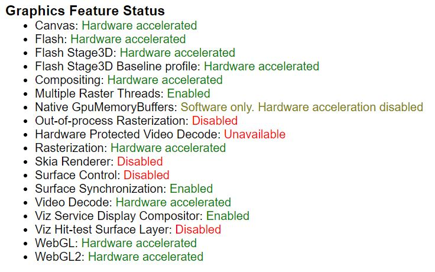
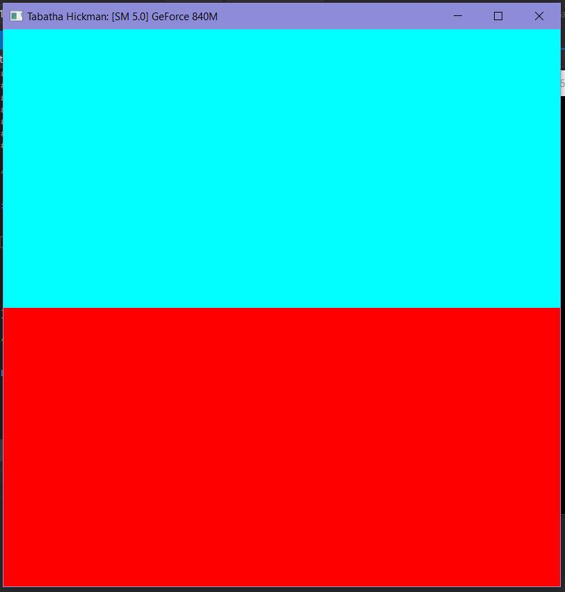
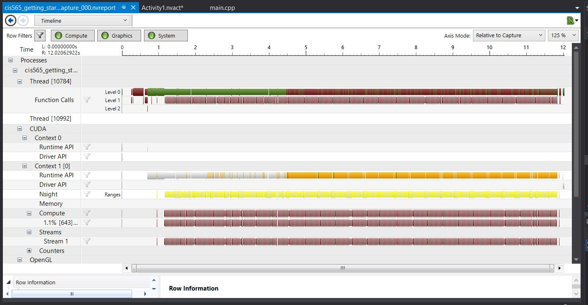
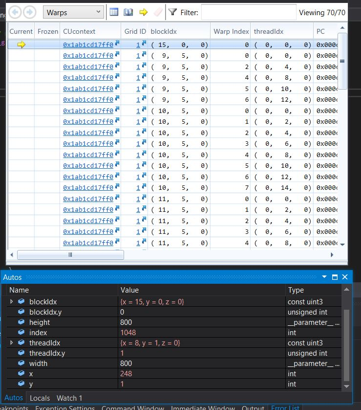

Project 0 Getting Started
====================

**University of Pennsylvania, CIS 565: GPU Programming and Architecture, Project 0**

* Tabatha Hickman
  * LinkedIn: https://www.linkedin.com/in/tabatha-hickman-335987140/
* Tested on: Windows 10 Pro, i7-5600U CPU @ 2.60GHz 16GB, GeForce 840M (personal computer) for non-DXR tests
* Tested on:  (SIGGLAB computer) for DXR tests

### (TODO: Your README)

*Compute Capability of GPU: 5.0

*Proof of WebGL Support:

*Project Execution Output:

*Nsight Analysis Results:

*Nsight Debugging Experimentation:

